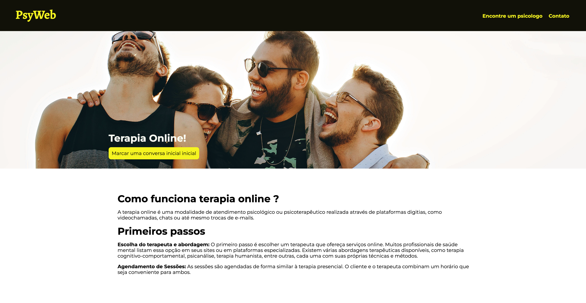

# PSYWEB

Site desenvolvimento para uso de profisionais de psicologia

## Overview
 - Visualização de informações sobre o psicologos
 - Busca por nome
 - Informações sobre terapia online
 - Informações sobre o tipo de abordagem do psicologo


## ScreenShots



## Build With
- HTML5
- (TailwindCSS)[https://tailwindcss.com/]
- (React)[https://react.dev/]
- (React Router DOM)[https://reactrouter.com/en/main]
- (Vite)[https://v3.vitejs.dev/] 

## How to build

- Download repository
```bash
$ git clone https://github.com/gomessgbr/maisPraTiPsyWeb.git
```
```bash
$ npm i 
```


## Autor

- GitHub - [@gomessgbr](https://github.com/gomessgbr)
